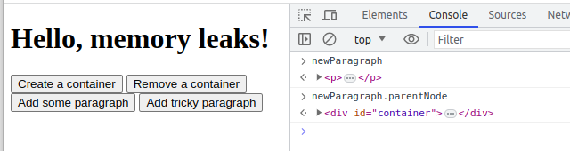

# Memory Leaks

A memory leak is a situation when the memory that is not required by an application anymore is keep being occupied and not returned to the pool of free memory.

JavaScript is one of the so called ***garbage collected*** languages. Garbage collected languages help developers manage memory by periodically checking which previously allocated pieces of memory can still be "reached" from other parts of the application. These way may reduce the chance of leaking memory. However, only developers can make it clear whether a piece of memory will be required in the future.

Most garbage collectors use an algorithm known as mark-and-sweep. The algorithm consists of the following steps:

   1. The garbage collector builds a list of "roots". Roots usually are global variables to which a reference is kept in code. In JavaScript, the "window" object is an example of a global variable that can act as a root. The window object is always present, so the garbage collector can consider it and all of its children to be always present (i.e. not garbage).

   2. All roots are inspected and marked as active (i.e. not garbage). All children are inspected recursively as well. Everything that can be reached from a root is not considered garbage.

   3. All pieces of memory not marked as active can now be considered garbage. The collector can now free that memory and return it to the OS.

The main cause for leaks in garbage collected languages are unwanted references. In the context of JavaScript, unwanted references are variables kept somewhere in the code that will not be used anymore and point to a piece of memory that could otherwise be freed.

Try this [STAND](https://volodymyrchuyko.github.io/js_memory_leaks/) to investigate memory leaks.

Follow the next steps:
   1. Open Developer tools on the `Memory` tab and take the first snapshot
   

   1. Click the `Create a container` button. This will add a `div` element to the page. Take the second snapshot. Choose `Comparison` in the dropdown menu and make sure the `HTMLDivElement` was added.
   

   1. Click the `Add some paragraph` button. See that some text has been added to the page. Take a snapshot and make sure the `HTMLParagraphElement` was added.
   

   1. Click the `Remove a container` button. Notice that the `div-container` has been removed from the page with all the text. Take a snapshot and make sure the `HTMLDivElement` and `HTMLParagraphElement` were removed.
   

   1. Now repeat steps 1-4 but use the `Add tricky paragraph` button instead of `Add some paragraph` this time. Notice that the `HTMLDivElement` and `HTMLParagraphElement` were removed like it was the previous time. However, the `Detached HTMLDivElement` and `Detached HTMLParagraphElement` appeared.
   

Why did that happen? Let's investigate the code to find out the answer.

At first glance, the `addSomeParagraph` and `addTrickyParagraph` functions may seem the same but look carefully. Someone has forgotten the `const` keyword while declaring the `newParagraph` variable. So the global variable `newParagraph` was created. It contains the reference to the `Detached HTMLParagraphElement`, which in his turn has a reference to the `Detached HTMLDivElement` in his element.parentNode field. That is why they can not be collected.

